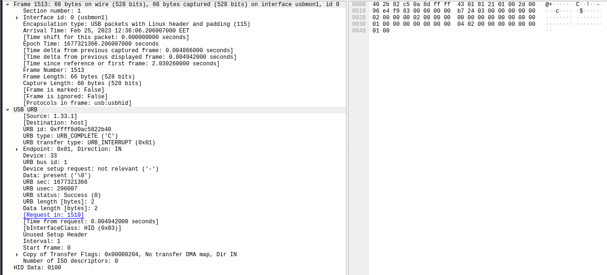
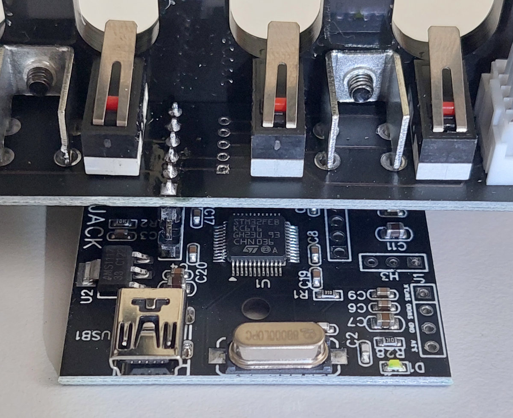
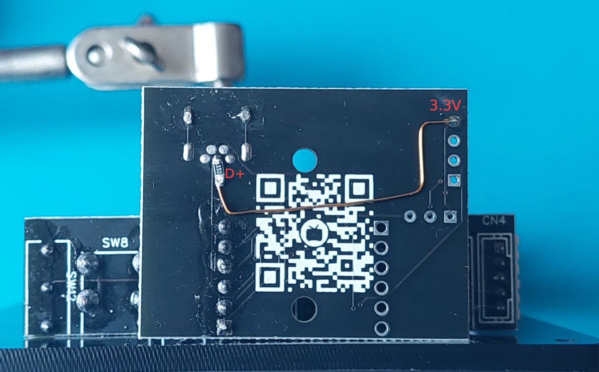
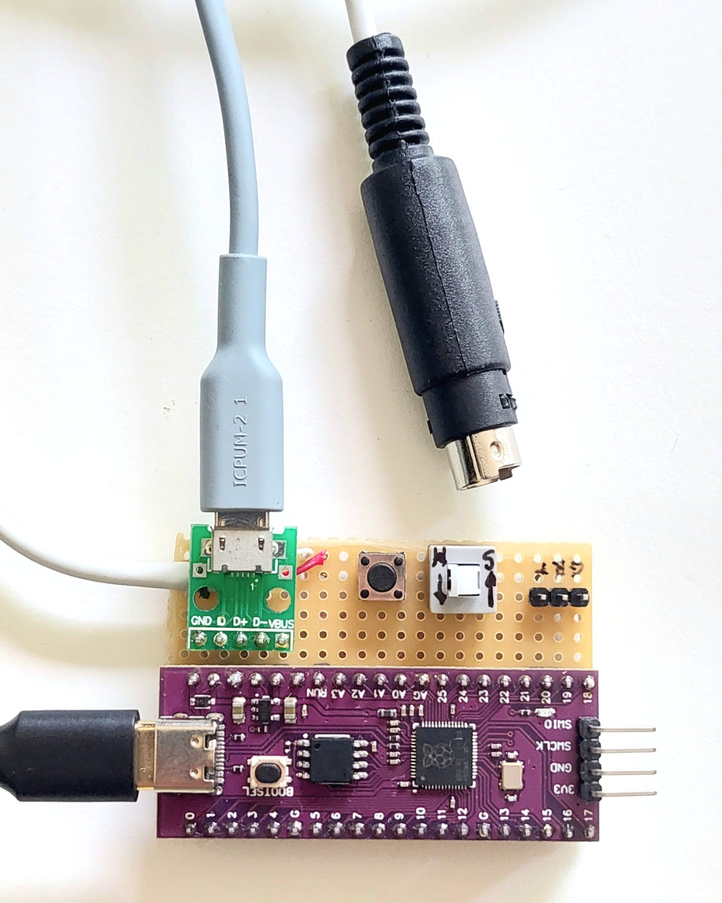

# Generic USB Shifter to Thrustmaster TH8A Emulator

The repository includes source code for a Thrustmaster TH8A emulator that utilizes the [Raspberry Pi Pico](https://www.raspberrypi.com/products/raspberry-pi-pico/) microcontroller unit (MCU) and a generic USB shifter from AliExpress. This project does not encourage the use of third-party addons for your sim racing setup. It is solely intended as an educational exercise. I do not take any responsibility for actions taken while using the information or source code from this project.

## Motivation

The Raspberry Pi Pico micro-controller is an amazing piece of technology that surpasses the capabilities of generic Arduino boards in most cases. I recently purchased a few myself and was eager to put them to use in a real-world project. Since I've developed a newfound interest in sim racing, I decided to embark on an emulator project to keep myself motivated and see it through to completion.

## Journey

The project journey began with me researching available generic USB gear shifters. After some time, I [found one](https://www.aliexpress.com/item/1005004132471839.html?spm=a2g0o.order_list.order_list_main.57.21ef1802T6ZTCG) that seemed to offer the best value for the price. However, I knew it would take at least a solid month before I could actually receive it.

While waiting for the gear shifter to arrive, I decided to explore how to interact with the [Thrustmaster wheel base](https://www.thrustmaster.com/en-us/products/tx-racing-wheel-leather-edition/) through its dedicated [port](https://en.wikipedia.org/wiki/Mini-DIN_connector). It didn't take long for me to come across an [amazing project](https://github.com/azzajess/USB-Shifter-to-Thrustmaster-Wheelbase) by [azzajess](https://github.com/azzajess) that had most of the information I was looking for. The project had all the features I wanted, but it was designed for the Arduino ecosystem. Luckily, it also included links to references explaining the protocol used and the data sent to the wheel base. With this wealth of information, I felt confident enough to start working on my own adaptation.

The implementation of the communication protocol between the wheelbase and Pico was not too difficult. I actually had a working proof-of-concept before the gear shifter arrived. However, I encountered some challenges when trying to make Pico communicate with the USB gear shifter.

The Raspberry Pi Pico MCU has a fantastic [C/C++ SDK](https://github.com/raspberrypi/pico-sdk) and provides [examples](https://github.com/raspberrypi/pico-examples) for most use cases. It even comes with an [example](https://github.com/raspberrypi/pico-examples/tree/master/usb/host/host_cdc_msc_hid) that allows you to connect a USB keyboard and log key presses. This example served as an excellent starting point for my testing. I made a few adjustments to the source code to capture more context details and successfully hooked up keyboards and mice. However, I faced some difficulties when trying to connect the USB gear shifter.

No matter what I tried, I couldn't get it to work. I noticed that Pico detected something being connected, but there was no further communication and the USB disconnect routine kept looping indefinitely. I even attempted to analyze the situation using Wireshark for USB protocol analysis, but I didn't notice any significant differences compared to when using a keyboard. Interestingly, it did work when connected to a PC.



At this point, I've already spent countless hours using a debugger and stepping through each function to figure out why Pico is having trouble determining the USB bus speed and establishing communication with the shifter. I decided to make some changes in the SDK to see if I could trigger a different path that would provide more details or even get it working somehow. By sheer luck, I stumbled upon something when I changed the values of the [SIE_CTRL_BASE](https://github.com/hathach/tinyusb/blob/86c416d4c0fb38432460b3e11b08b9de76941bf5/src/portable/raspberrypi/rp2040/hcd_rp2040.c#LL61C3-L61C16) bits. When I switched the bit from `USB_SIE_CTRL_PULLDOWN_EN_BITS` to `USB_SIE_CTRL_PULLUP_EN_BITS`, the connection started working 🤯. I was a bit confused about what exactly this change accomplished and what adjustments were necessary to ensure that the SDK code remained unchanged.

After delving further into the [RP2040 datasheet](https://datasheets.raspberrypi.com/rp2040/rp2040-datasheet.pdf), I discovered some interesting information about USB pull resistors and how they determine the bus speed. I also did some [additional research online](https://www.beyondlogic.org/usbnutshell/usb2.shtml#SpeedIdentification), which only confirmed my initial observation: it seems that the USB gear shifter may be missing the necessary pull-up resistors that are responsible for defining the USB bus speed. It was time to open up the USB gear shifter and inspect its internals.

Well, the mechanical parts seemed sturdy, but I was quickly disappointed with the electronics when I discovered that the main MCU was just a [cheap clone of the STM32](https://hackaday.com/2020/10/22/stm32-clones-the-good-the-bad-and-the-ugly/).



Since there were no external pull-up resistors available, I decided to take the next logical step and add one myself.



This simple hardware patch has proven to work as intended, allowing the Raspberry Pi Pico to correctly identify the USB bus speed and send data over it.

After assembling all the parts, I was able to bring the emulator to life. It's a straightforward device that acts as a middleman, interpreting commands from a [USB HID device](https://en.wikipedia.org/wiki/USB_human_interface_device_class) and translating them into the [I2C protocol](https://en.wikipedia.org/wiki/I%C2%B2C) to send to the wheelbase. This approach not only reduced the cost of the parts compared to the previously mentioned project but also achieved the desired functionality with ability to further expand on it.



---

## Technical Details

### UDEV Rule

Create udev rule for Pico UART device

`cat > /etc/udev/rules.d/95-pico.rules`

```
# Raspberry Pi Pico
SUBSYSTEM=="tty", ATTRS{idVendor}=="2e8a", ATTRS{idProduct}=="000c", GROUP="dialout", MODE="0666", SYMLINK+="pico"

```

### Monitor UART

```bash
minicom -b 115200 -8 -D /dev/pico
# or
minicom -b 115200 -8 -D /dev/ttyACM0
```

### Connection

- VDD -> RED
- VSS -> GND
- I2C-SCL -> WHITE
- I2C-SDA -> GREEN

## Connection Diagram


## Raspberry Pi Pico Pin-outs

Original Raspberry Pi Pico


Pink Chinese Clone


## Flash Binaries

```bash
# build binary manually
make build

# flash binary directly using openocd
make flash

# build and flash
make apply
```

## Picoprobe Wiring


## USB Shifter Analysis

```bash
lsusb
# ...
# Bus 001 Device 033: ID 8587:5757 FreeJoy JACK-SQ
# ...

# Find out more details about specific USB device.
lsusb -d 8587:5757 -v
```

Wireshark filter for USB Device 33 on Bus 1 `usb.src == "1.33.1" || usb.dst == "1.33.1"`.

## Notes

Queue is being filled using interrupts. Later, pooling task reads from the queue and acts on it.

IRQ calls [`static void __tusb_irq_path_func(hcd_rp2040_irq)(void)`](/pico/pico-sdk/lib/tinyusb/src/portable/raspberrypi/rp2040/hcd_rp2040.c) function.

```c
// USB controller memory location
#define USBCTRL_REGS_BASE _u(0x50110000)

```

The USB shifter is missing a 1.5K pull-up resistor on DP (D+) line that would let MCU know its supported speed.

TSS Sparco handbrake I2C data [@forum](https://www.isrtv.com/forums/topic/24532-gearbox-connector-on-base/?do=findComment&comment=232234)

```
02 0C 02 00 FF 80 81 80 81 00 00 00 00 00

02 0C 02 00 8A 80 4D 80 4D 00 00 00 00 00

02 0C 02 00 82 80 4A 80 4A 00 00 00 00 00

02 0C 02 01 17 7F 20 7F 20 00 00 00 00 00

02 0C 02 01 0F 7F 1D 7F 1D 00 00 00 00 00
```

> Above TSS handbrake's I2C data mean about 0-100% brake force. Of course you need to send out every row maybe 100 times. Because of 250ms. Elsewhere you won't see anything.

```
Handbreak min -> max

0  02 02 02 02 02 // TSS handbrake
1  0C 0C 0C 0C 0C // Unknown
2  02 02 02 02 02 // ?? Device ID
3  00 00 00 01 01 // Unknown
4  FF 8A 82 17 0F // Unknown
5  80 80 80 7F 7F // Unknown ◄─┐
6  81 4D 4A 20 1D // Unknown ◄─│─┐
7  80 80 80 7F 7F // Unknown ◄─┘ │
8  81 4D 4A 20 1D // Unknown ◄───┘
9  00 00 00 00 00 // Unknown
A  00 00 00 00 00 // Unknown
B  00 00 00 00 00 // Unknown
C  00 00 00 00 00 // Unknown
D  00 00 00 00 00 // Unknown
```

## References

- [Raspberry Pi Pico SDK](https://github.com/raspberrypi/pico-sdk)
- [Raspberry Pi Pico and RP2040 - C/C++ Part 1: Blink and VS Code](https://www.digikey.lt/en/maker/projects/raspberry-pi-pico-and-rp2040-cc-part-1-blink-and-vs-code/7102fb8bca95452e9df6150f39ae8422)
- [Raspberry Pi Pico and RP2040 - C/C++ Part 2: Debugging with VS Code](https://www.digikey.be/en/maker/projects/raspberry-pi-pico-and-rp2040-cc-part-2-debugging-with-vs-code/470abc7efb07432b82c95f6f67f184c0)
- [Raspberry Pi Pico and Pico W](https://www.raspberrypi.com/documentation/microcontrollers/raspberry-pi-pico.html)
- [RP2040 Datasheet](https://datasheets.raspberrypi.com/rp2040/rp2040-datasheet.pdf)
- [Raspberry Pi Pico SDK](https://github.com/raspberrypi/pico-sdk)
- [Picoprobe](https://github.com/raspberrypi/picoprobe)
- [Getting started with Raspberry Pi Pico](https://datasheets.raspberrypi.com/pico/getting-started-with-pico.pdf)
- [Picoprobe: Using the Raspberry Pi Pico as Debug Probe](https://mcuoneclipse.com/2022/09/17/picoprobe-using-the-raspberry-pi-pico-as-debug-probe/)

- [USB Shifter to Thrustmaster Wheelbase](https://github.com/azzajess/USB-Shifter-to-Thrustmaster-Wheelbase)
- [Awesome Arduino](https://github.com/Lembed/Awesome-arduino)
- [RPi Pico I2C Address Limitation](https://raspberrypi.github.io/pico-sdk-doxygen/group__hardware__i2c.html#i2c_example)
- [GoLang Compiler Directives](https://pkg.go.dev/cmd/compile#hdr-Compiler_Directives)
- [[RP2040] First byte of X52 Pro HID report is zero, unless CFG_TUSB_DEBUG >= 2](https://github.com/hathach/tinyusb/issues/1883)
- [capturing usb on linux with wireshark](https://www.youtube.com/watch?app=desktop&v=bhZqA1By314)
- [picoprobe-cmsis-v1.0.1](https://github.com/raspberrypi/picoprobe/releases/tag/picoprobe-cmsis-v1.0.1)
- [LearnEmbeddedSystems/rp2040-project-template](https://github.com/LearnEmbeddedSystems/rp2040-project-template/tree/5f169a12eb940ed6a86003672052db57d2a82abc)
- [USB in a NutShell](https://www.beyondlogic.org/usbnutshell/usb2.shtml)
- [STM32 CLONES: THE GOOD, THE BAD AND THE UGLY](https://hackaday.com/2020/10/22/stm32-clones-the-good-the-bad-and-the-ugly/)
- [STM32F103 USB circuit](https://community.st.com/s/question/0D50X00009XkY1uSAF/stm32f103-usb-circuit)
