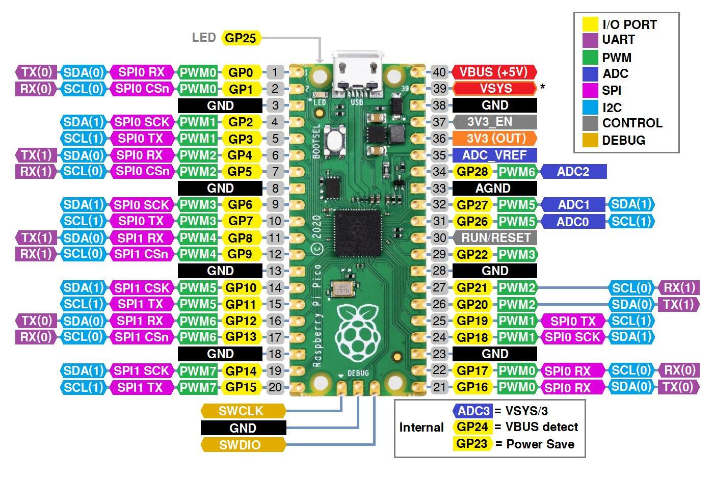
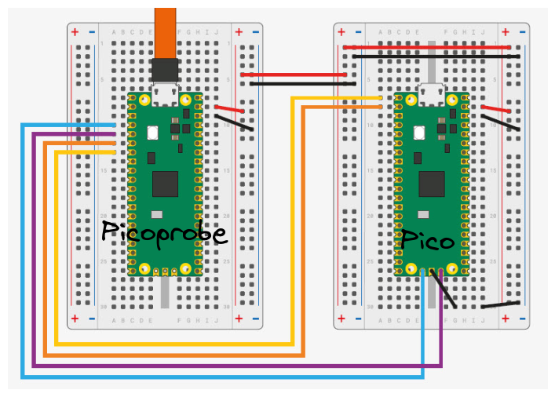

# Thrustmaster TH8A Emulator

This repository contains continuation of work started in [the previous repository](https://github.com/va1da5/tm-th8a-emulator-research-stm32).

## Notes

TSS Sparco handbrake I2C data

```
02 0C 02 00 FF 80 81 80 81 00 00 00 00 00

02 0C 02 00 8A 80 4D 80 4D 00 00 00 00 00

02 0C 02 00 82 80 4A 80 4A 00 00 00 00 00

02 0C 02 01 17 7F 20 7F 20 00 00 00 00 00

02 0C 02 01 0F 7F 1D 7F 1D 00 00 00 00 00
```

> Above TSS handbrake's I2C data mean about 0-100% brake force. Of course you need to send out every row maybe 100 times. Because of 250ms. Elsewhere you won't see anything.

```
0  02 02 02 02 02 // TSS handbrake
1  0C 0C 0C 0C 0C // Unknown
2  02 02 02 02 02 // ?? Device ID
3  00 00 00 01 01 // Unknown
4  FF 8A 82 17 0F // Unknown
5  80 80 80 7F 7F // Unknown ◄─┐
6  81 4D 4A 20 1D // Unknown ◄─│─┐
7  80 80 80 7F 7F // Unknown ◄─┘ │
8  81 4D 4A 20 1D // Unknown ◄───┘
9  00 00 00 00 00 // Unknown
A  00 00 00 00 00 // Unknown
B  00 00 00 00 00 // Unknown
C  00 00 00 00 00 // Unknown
D  00 00 00 00 00 // Unknown
```

### UDEV Rule

Create udev rule for Pico UART device

`cat > /etc/udev/rules.d/95-pico.rules`

```
# Raspberry Pi Pico
SUBSYSTEM=="tty", ATTRS{idVendor}=="2e8a", ATTRS{idProduct}=="000a", GROUP="dialout", MODE="0666", SYMLINK+="pico"

```

### Monitor UART

```bash
tinygo monitor -port /dev/pico # /dev/ttyACM0

minicom -b 115200 -8 -D /dev/pico
```

### Connection

- VDD -> RED
- VSS -> GND
- I2C-SCL -> WHITE
- I2C-SDA -> GREEN

## Connection Diagram

TODO

## Raspberry Pi Pico Pin Diagram



## Flash Binaries

```bash
# build binary manually
make build

# flash binary directly using openocd
make flash
```

## Linting

There is an option to enable C++ code linting functionality using [Clang-tidy](https://clang.llvm.org/extra/clang-tidy/). Install the linter using the commands below.

```bash
apt update && apt install clang-tidy

```

## Picoprobe Wiring



## References

- [Raspberry Pi Pico SDK](https://github.com/raspberrypi/pico-sdk)
- [Raspberry Pi Pico and RP2040 - C/C++ Part 1: Blink and VS Code](https://www.digikey.lt/en/maker/projects/raspberry-pi-pico-and-rp2040-cc-part-1-blink-and-vs-code/7102fb8bca95452e9df6150f39ae8422)
- [Raspberry Pi Pico and RP2040 - C/C++ Part 2: Debugging with VS Code](https://www.digikey.be/en/maker/projects/raspberry-pi-pico-and-rp2040-cc-part-2-debugging-with-vs-code/470abc7efb07432b82c95f6f67f184c0)
- [Raspberry Pi Pico and Pico W](https://www.raspberrypi.com/documentation/microcontrollers/raspberry-pi-pico.html)
- [RP2040 Datasheet](https://datasheets.raspberrypi.com/rp2040/rp2040-datasheet.pdf)
- [Raspberry Pi Pico SDK](https://github.com/raspberrypi/pico-sdk)
- [Picoprobe](https://github.com/raspberrypi/picoprobe)
- [Getting started with Raspberry Pi Pico](https://datasheets.raspberrypi.com/pico/getting-started-with-pico.pdf)
- [Picoprobe: Using the Raspberry Pi Pico as Debug Probe](https://mcuoneclipse.com/2022/09/17/picoprobe-using-the-raspberry-pi-pico-as-debug-probe/)

- [USB Shifter to Thrustmaster Wheelbase](https://github.com/azzajess/USB-Shifter-to-Thrustmaster-Wheelbase)
- [Awesome Arduino](https://github.com/Lembed/Awesome-arduino)
- [RPi Pico I2C Address Limitation](https://raspberrypi.github.io/pico-sdk-doxygen/group__hardware__i2c.html#i2c_example)
- [GoLang Compiler Directives](https://pkg.go.dev/cmd/compile#hdr-Compiler_Directives)
